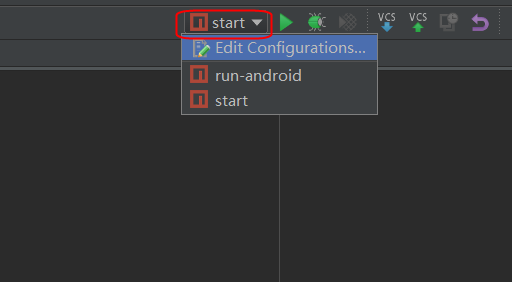
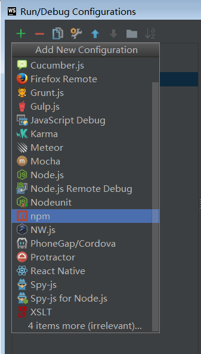
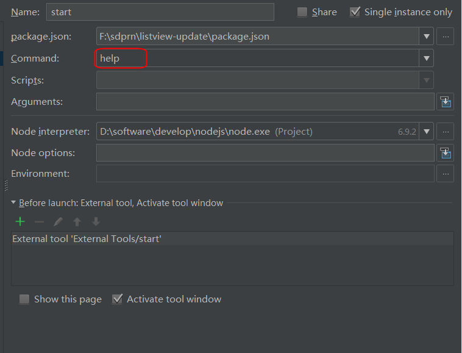
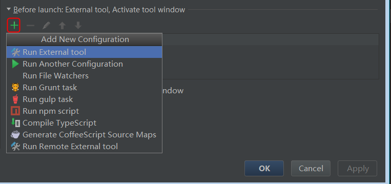
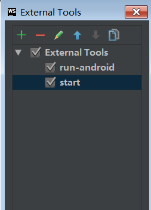
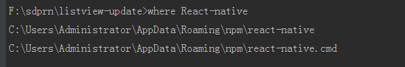
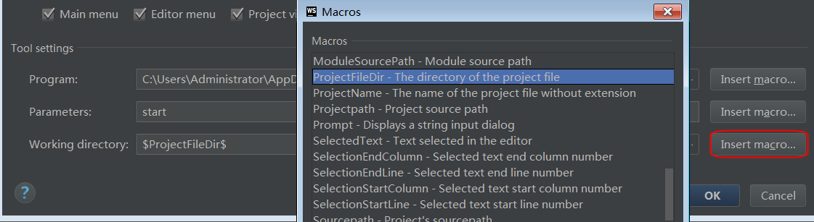
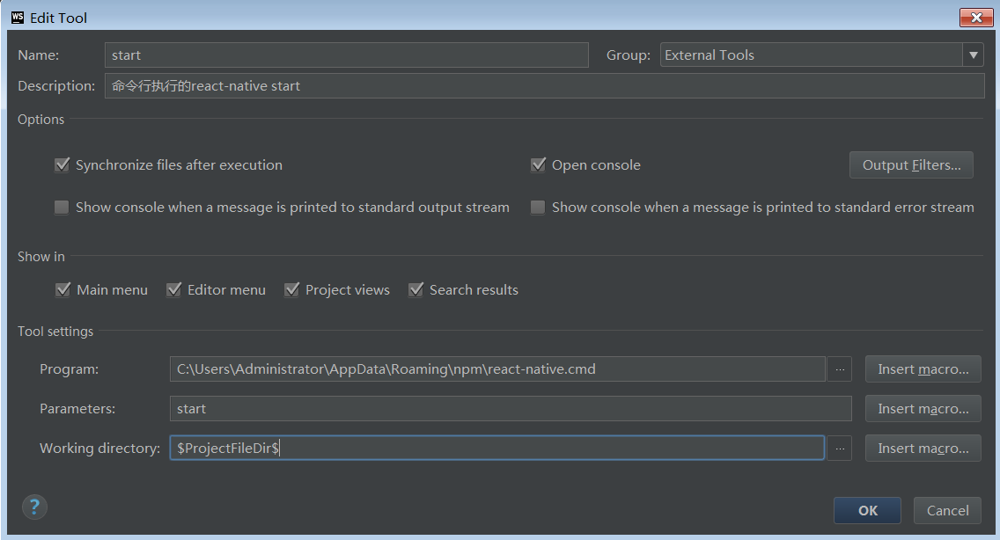

# window系统下 webstorm编译环境的配置

注:webstorm版本要求是11.0.3以上，支持npm配置。

### 1.创建编译命令

### 2.添加npm编译命令

### 3.修改Command为help
因为我们不需要它，但是又不想受到干扰，所以选择help。

### 4.创建External tool

### 5.配置External tool

#### a.通过命令终端找到React-native命令所在

#### b.项目所在路径的变量

#### c.完整的设置

